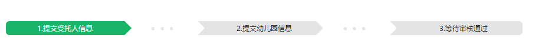

###效果


html源码：
```html 
   <ul class="submitInfo-guide">
        <li class="submitInfo-guide-tab radius-left submitInfo-guide-active firstStep-nav">
            1.提交受托人信息<span class="triangle-save-left fr"></span>
        </li>
        <li class="dot-container">
            <span class="dot">.</span><span class="dot">.</span><span class="dot">.</span>
        </li>
        <li class="submitInfo-guide-tab submitInfo-guide-default secondStep-nav">
            <span class="triangle-left fl"></span>2.提交幼儿园信息<span class="triangle-save-left fr"></span>
        </li>
        <li class="dot-container">
            <span class="dot">.</span><span class="dot">.</span><span class="dot">.</span>
        </li>
        <li class="submitInfo-guide-tab radius-right submitInfo-guide-default thirdStep-nav">
           <span class="triangle-left fl"></span>3.等待审核通过
        </li>
    </ul>    
```

sass 源码：
```scss
.submitInfo-guide{
	@extend %mg-lr-30;
	overflow:hidden;	
	line-height:86px;
	padding: 30px 0 30px 0;


	border:1px solid #ccc{
		left:0px;
		right:0px;
		top:0px;
	};

	.submitInfo-guide-tab{
		width:225px;
		margin-right:20px;	
		text-align: center;		
	}

	li{
		float:left;	
		height: 24px;
		line-height: 24px;	
		overflow: hidden;
	}
	li.dot-container{
		margin-top:-2px;
		margin-right: 34px;
	}

	.radius-left{
		border-top-left-radius:6px;
		border-bottom-left-radius:6px;
	}
	.radius-right{
		border-top-right-radius:6px;
		border-bottom-right-radius:6px;
	}
	&-default{
		color:#000;
		background-color: #e4e4e4;	
	}
	&-active{
		color:#fff;
		background-color: #1ab469;
	}
	&-pass{
		color: #fff;
		background-color: #bae8d2;
	}
}

.triangle-left,.triangle-right,.triangle-save-left{
	display:inline-block;
	border: 12px solid transparent;
	width:0px;
	height:0px;	
}
.triangle-left{
	border-left-color:#fff;
}
.triangle-right{
	border-right-color:#fff;
}
.triangle-save-left{
	border-color:#fff;
	border-left-color:transparent;
}

.dot{
	line-height:2px;
	font-size:40px;	
	color:#e4e4e4;
	margin-right:6px;
	margin-top:-6px;
}
```
