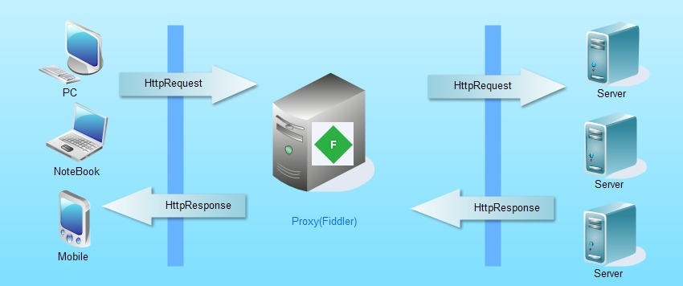
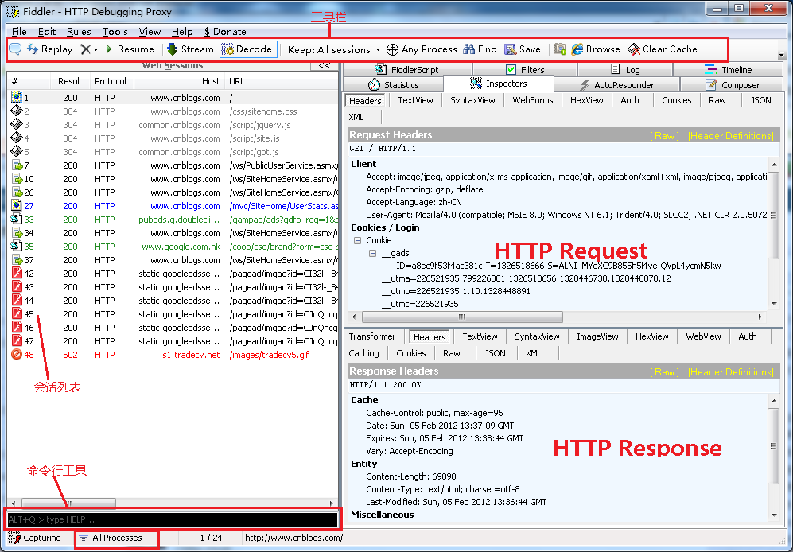
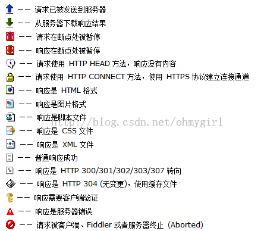
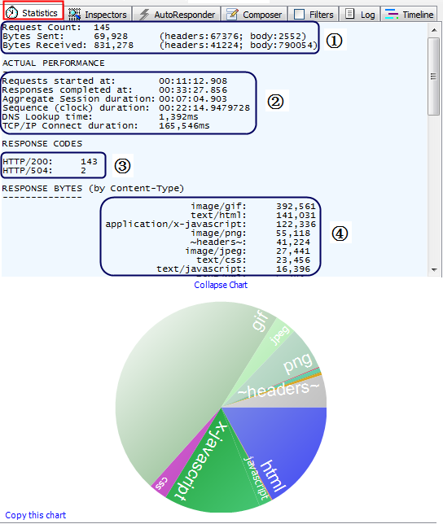
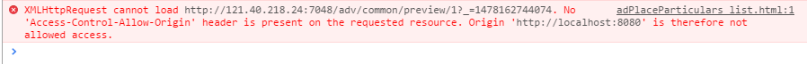
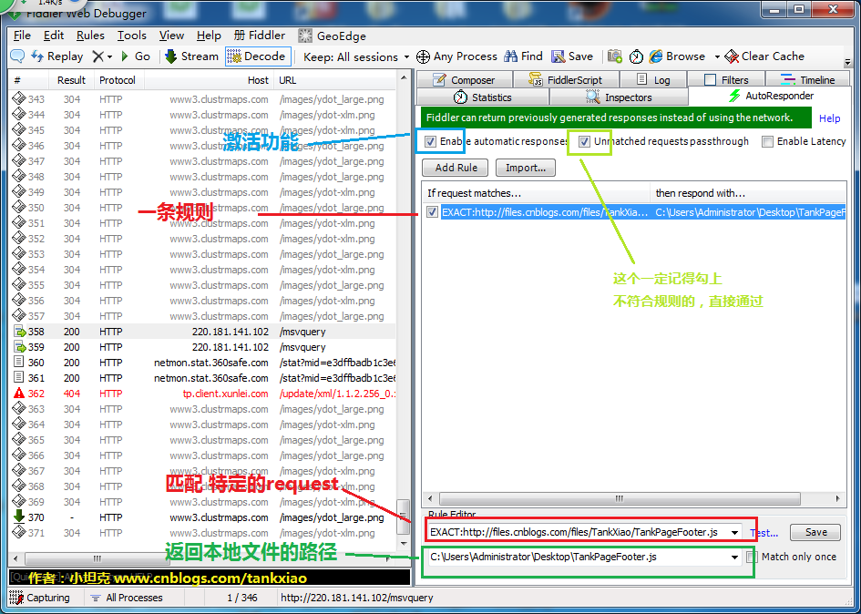
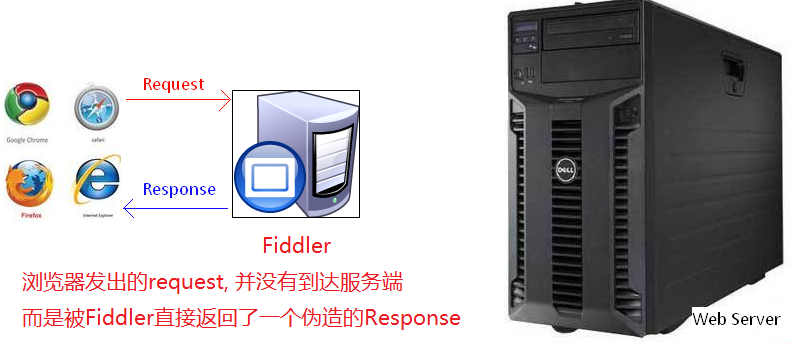
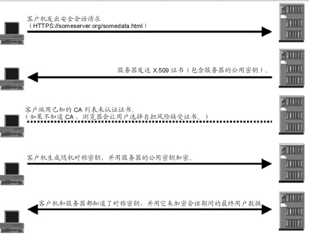

### 为什么需要fidder
作为前端开发人员，相信大家都对Chrome和Firebug比较熟悉，开发时通常要进行一些监听请求、查看请求文件、检查本地数据等。chrome和Firebug些可以让我们快速找到问题，但修复问题则要修改代码，若想看修改效果则要提交代码到服务器，并与线上代码合并，还要发布后才能查看修改的效果。如果只是修改一个小问题或者验证自己修改的是否正确，走修这个过程通常很麻烦。那有什么方法可以快速查看呢？
>Fiddler简介:它能记录所有客户端和服务器的http和https请求，允许你监视，设置断点，甚至**修改输入输出数据**。

### 认识fiddler
- **工作原理**


- **工作页面**



- **文件类型**



### fiddler 的功能简介
#### Statistics


 

1. 请求总数、请求包大小、响应包大小
2. 请求起始时间、响应结束时间、握手时间、等待时间、路由时间、TCP/IP传输时间
3. HTTP状态码统计
4. 返回的各种类型数据的大小统计以及饼图展现


#### Inspectors
请求相关的，请看fiddler上。

#### AutoResponder
#### Composer
按报头发送。在composer Tab上，点击Scratchpad tab。选中拖进来的session，点击Execute进行执行。 [参考](http://docs.telerik.com/fiddler/Generate-Traffic/Tasks/ResendRequest)

#### Filters
* 过滤请求
配置时需填写host名字

* 跨域设置，允许跨域

设置set response header 选项：Access-Control-Allow-Origin：http://localhost:8080。设置完即可跨域（已测试）。

####  Fidder 修改线上文件
替换线上的文件使用的就是AutoResponder的功能。


1. 选择一条session点击右侧的Add Rule，添加到右侧的规则列表中
2. 正则分为EXACT、regex等多种，这里面使用的是正则表达式。根据正则进行相关的匹配。
3. cope一份想捕获的url，点击右侧的Test进行测试，如果绿色就标识匹配。
4. 勾选匹配按钮，激活功能。
5. 选择替换文件，返回本地文件。
6. 再次运行页面，查看替换文件。
示意图：



达到替换的原因：这个些规则，就是将请求服务器端的资源，经过fiddler时将本地的文件返回，这样就可以达到，其他资源是线上的，要修改的目标是本地的。

拦截后的fiddler工作示意图：


#### Fiddler 替换一组文件
例如：
* regex:^http://114.55.104.12:7048/static
* E:\adv\adv-admin\src\main\webapp\static\src
只要目录中的文件与url中的路径相匹配，就可以进行替换。

*使用正则
匹配路径：regex: ^http://114.55.104.12:7048/static/([\w]+)/([\w\.]+)[^/]*$
目标目录：E:\adv\adv-admin\src\main\webapp\static\src\$1\$2

###  fiddler 的其它功能
* Fiddler 验证修改效果

通常开发移动端app中的html代码时，我们看到的只是本地效果（localhost），如果要看线上的效果时就需要发布到测试环境中。如果有发布权，也许实现查看效果并不难，但对环境不熟悉的人或者没有发布权限的人，这都要经过一系列的沟通，才能看到效果。即便有权限，你还要提交代码、合并分支、发布代码、查看效果、检查代码是否影响其它页面，这个修改并看到效果的流程也得5-15分钟。没问题还好，如果检查出问题，还得走这个流程，何必要花这些时间呢？可以先使用fiddler做代理，将效果验证后再发布。

* 使用fiddler实现两端联调

在和两端联合开发时（也适用pc端），两端或许会需要访问h5的页面，需要做一个跳转或者一个操作，此时处于开发阶段测试还没介入，没有这个环境做这个联动，怎么办？等到联调时再做这件事？这可能延误两端。
在开发时我们可以根据域名和对应的文件夹目录，可以拼写出url。此时可以和两端商量使用代理，把url给两端并让两端设置连接到你机器上，再在机器上打开fidder，捕获这个url并返回文件，此时两端就可以正常访问了。此时做调试和测试都比较方便的。如果界面出现异常，在pc端打开给的url，即可捕捉到问题，修复后让两端刷新下即可浏览到新的文件。

* 使用手机App查看开发的页面

另外一个场景也适用这个。例如你开发一个app页面，可是浏览不到线上的效果，这个种情况怎么处理？
此时其实也是也可以浏览未发布的文件的，手机设置代理，并用fiddler抓取一个app中的h5的页面，使用fiddler将这个url返回的文件，替换为你想看到的文件，这样就可以看到效果了。当然你也可以做兼容性测试，可以在不同种类的手机中效果。


### 创建一个响应
通常情况下，请求是正常的。如果我们在前端做了异常处理，如果我们想要一个非正常的请求怎么办？可能这种情况下，后台也不能快速满足我们的需求，此时就可以创建一个响应体。


1. 创建一个拦截规则
2. 在选择文件中选择Create New Response...
3. 点击save就会弹出一个框子，可以响应报头，响应体等。通常可以查看一个请求，把响应体黏贴进来并做修改
4. 点击save 即可保存这个响应
5. 再次请求就可查看到效果
此方法我不常用，需要自己尝试。


例如设置响应json：
```js
设置的报体：HTTP/1.1 200 Generated
Content-Length: 4195
Content-Type: text/plain; charset=utf-8

{
	"message":"success",
	"result":[
		{
			"code":"open_parent",
			"groupId":1,
			"name":"开屏",
			"postions":[
				{
					"ads":[],
					"posNum":1,
					"postionId":1,
					"typeCode":"open"
				}
			]
		}
	],
	"status":0
}
```
其它类型的和此类似。

### 修改请求参数
当在抓取页面错误的情况下，可能会遇到向后台传参数的错误，有时我们让后台做测试并判断是什么错误。
有时我们想修改传递的参数，可这些都是异步的怎么修改呢？参数不在我们控制范围之内（闭包情况），这种情况下，我们只能修改请求时的参数。


1. Rule→Automatic Breakpoints → Before Requests 
2. 发送请求，双击这个session，选择webForms Tab，即可看到请求的参数，此时做修改即可。
3. 点击 Break on Response 即可发送
4. 点击 Run to Completion 即可完成
5. 如果拦截太多请求时，可以点击Go按钮，快速情况拦截。

取消拦截：Rule→Automatic Breakpoints → Disabled


###Fiddler 中使用https

 * 什么是Https？
https 实际上就是Http over SSL。HTTPS协议使用SSL在发送方把原始数据进行加密，然后在接受方进行解密，加密和解密需要发送方和接受方通过交换共知的密钥来实现，因此，所传送的数据不容易被网络黑客截获和解密。


这也就是为什么需要证书。[Fiddler 配置解密HTTPS](http://docs.telerik.com/fiddler/configure-fiddler/tasks/decrypthttps)

* [浏览器端的使用https](http://docs.telerik.com/fiddler/Configure-Fiddler/Tasks/FirefoxHTTPS)

* 移动端的一些设置及使用
移动端需要设置： Tools > Fiddler Options > Connections，勾选：Allow remote computers to connect
* [安卓端抓包与使用https](http://docs.telerik.com/fiddler/Configure-Fiddler/Tasks/ConfigureForAndroid#disable-https-decryption)

