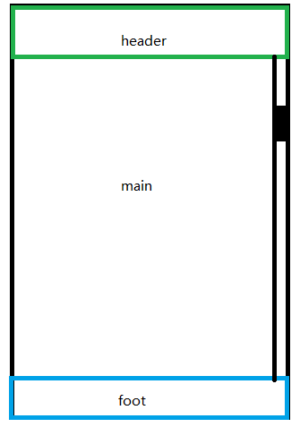

## 常见scroll 滑动的bug

### 1.ios上滚动效果不流畅
```css
overflow-y: scroll; /* has to be scroll, not auto */
-webkit-overflow-scrolling: touch; /* 用来控制元素在移动设备上是否使用滚动回弹效果 */
overflow-scrolling: touch;
z-index:1; /* 这个属性会出现偶尔卡顿 */
```

* 为什么添加[z-index](https://segmentfault.com/a/1190000002783265)

* [-webkit-overflow-scrolling:touch属性副作用--QQ内置浏览器空白处理](https://juejin.im/post/5a275825f265da431280c883)
 解决方法
 ```css
 -webkit-backface-visibility: hidden;
 -webkit-transform: translate3d(0,0,0);
 ```

 > Safari对于overflow-scrolling用了原生控件来实现。对于有-webkit-overflow-scrolling的网页，会创建一个UIScrollView，提供子layer给渲染模块使用。

### 2.按钮fixed到视口，快速滑动页面，页面布按钮会抖动
修改这个bug，需要调整页面布局，让滚动区域不包含按钮。

 

让main包含需要滚动的内容。
头部和底部的定位设为absolute会比设为fixed体验更好（fixed布局在移动端有问题）。大致代码如下：

```css
html, body {
 height: 100%;
}
main {
    padding: 50px 0;
    height: 100%;
    overflow-y: scroll;
    -webkit-overflow-scrolling: touch;
}
```


### 3.在ios中的弹窗，滚动到底部时，可滚动弹窗下的页面
解决方案：
```css
  overflow:auto;
  -webkit-overflow-scrolling:touch; 
```
```html
<div style="overflow:auto;-webkit-overflow-scrolling:touch;">
	<div style="min-height:101%">
		dynamic content
	</div>
</div>
```

如果外层绑定有 ```js touchmove事件滚动 ``` ,需要阻止冒泡。 

 * [参考与引用](https://www.cnblogs.com/xiahj/p/8036419.html)


### 4.在ios系统的UC浏览器和手百中，在页面滚动未停止之前，滚动事件无法被触发

> bug描述：页面滚动到一定位置时，顶部的tap框要吸顶。在ios的uc浏览器中，只有滚动停止，才会触发吸顶操作。

* 第一种：若是一个顶部nav，可以使用css 解决方案
```css
    position: sticky
```


* 第二种：若滚动触发底部或逻辑操作

在android端没有这个问题，ios下存在此问题。可以在ios下，使用iscroll、swiper、ontouchmove等解决方案。

> 问题的原因：ios的webview 内核 设定了其在进行momentum scrolling(弹性滚动)时,会停止所有的 事件响应 及 DOM操作引起的页面渲染 (亲测),故 onscroll 不能实时响应 [参考](https://segmentfault.com/q/1010000004453730)。

> uc对此问题的回复：As you can see on mobile, the scroll events only fire at the end of the scroll. This is not a bug, it's by design.[参考](http://andyshora.com/mobile-scroll-event-problems.html)

引申问题：为什么只有手百与uc有此问题？

* 一开始苹果禁止使用第三方浏览器，大家只得使用UIWebView，有各种奇葩问题。
后来让用WKWebView了，但国内的一些浏览器没有迁移到WKWebView内核。[参考](http://www.cnblogs.com/chris-oil/p/6164966.html)


### 5.关于scroll的错误
chrome 报了一个关于scroll的错误。

```js
mbase_d5e1fb8.js:formatted:1833 
[Intervention] Unable to preventDefault inside passive event listener due to target being treated as passive. 
```
chrome提供的解决方案[See](https://www.chromestatus.com/features/5093566007214080)。

#### passive 属性
>The problem is that most often listeners will not call , but the browser needs to wait for the event to finish to be sure of that.Developer-defined "passive event listeners" solve this.window.addEventListener("touchstart", func, {passive: true} );Now calls to inside the listener will be ignored.

#### 其他参考

* [chromestatus](https://www.chromestatus.com/features/5093566007214080)
* [chrome](https://developers.google.com/web/updates/2017/01/scrolling-intervention)
* [实现自定义手势](http://wf.uisdc.com/cn/input/touch-input/touchevents/#touch-mouse-and-ms-pointer-events]


