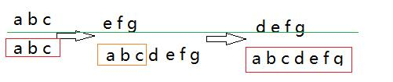

# React 增量更新
### applies updates in order of priority（按优先级应用更新）
```js
   let state;
    class Foo extends React.Component {
      state = {};
      componentDidMount() {
        ReactNoop.deferredUpdates(() => {
          // Has low priority
          this.setState({b: 'b'});
          this.setState({c: 'c'});
        });
        // Has Task priority
        this.setState({a: 'a'});
      }
      render() {
        state = this.state;
        return <div />;
      }
    }

    ReactNoop.render(<Foo />);
    ReactNoop.flushDeferredPri(25);// 刷新时间
    expect(state).toEqual({a: 'a'});// 优先级高的
    ReactNoop.flush();
    expect(state).toEqual({a: 'a', b: 'b', c: 'c'});
```

看这个例子时，发现更新是可以分出优先级的，那么疑问随之而来，优先级是如何计算呢？

路径地址：react\packages\react-reconciler\src\ReactFiberScheduler.js

```js
function deferredUpdates<A>(fn: () => A): A {
  const currentTime = requestCurrentTime();// 请求当前时间
  const previousExpirationContext = expirationContext;
  const previousIsBatchingInteractiveUpdates = isBatchingInteractiveUpdates;
  expirationContext = computeAsyncExpiration(currentTime); //计算异步过期时间
  isBatchingInteractiveUpdates = false; //非批量更新
  try {
    return fn(); // 计算刷新
  } finally {
    expirationContext = previousExpirationContext;
    isBatchingInteractiveUpdates = previousIsBatchingInteractiveUpdates;
  }
}
```
通过计算 Expiration 来划分执行的批次及结果。—————— 推测，还待往下看

### 删除 state 操作
```js
it('only drops updates with equal or lesser priority when replaceState is called', () => {
    let instance;
    let ops = [];
    class Foo extends React.Component {
      state = {};
      componentDidMount() {
        ops.push('componentDidMount');
      }
      componentDidUpdate() {
        ops.push('componentDidUpdate');
      }
      render() {
        ops.push('render');
        instance = this;
        return <div />;
      }
    }

    ReactNoop.render(<Foo />);
    ReactNoop.flush();

    ReactNoop.flushSync(() => {//注意此处：同步，同步
      ReactNoop.deferredUpdates(() => {
        instance.setState({x: 'x'});
        instance.setState({y: 'y'});
      });
      instance.setState({a: 'a'});
      instance.setState({b: 'b'});
      ReactNoop.deferredUpdates(() => {
        instance.updater.enqueueReplaceState(instance, {c: 'c'});//还有这样的操作。。
        instance.setState({d: 'd'});
      });
    });

    // Even though a replaceState has been already scheduled, it hasn't been flushed yet because it has async priority.
    // 尽管 replaceState 已经预定，但是还没有更新，这是因为具有异步更新。
    expect(instance.state).toEqual({a: 'a', b: 'b'});
    expect(ops).toEqual([
      'render',
      'componentDidMount',
      'render',
      'componentDidUpdate',
    ]);

    ops = [];

    ReactNoop.flush();//需要熟悉，刷新
    // Now the rest of the updates are flushed, including the replaceState.
    expect(instance.state).toEqual({c: 'c', d: 'd'});
    expect(ops).toEqual(['render', 'componentDidUpdate']);
  });
```

```js
flush(): Array<mixed> {
    return ReactNoop.flushUnitsOfWork(Infinity);//更新所有 units of work 
}
```

### abort an update, schedule additional updates, and resume （终止更新、安排额外的更新、重新开始）
```js
    let instance;
    class Foo extends React.Component {
      state = {};
      render() {
        instance = this;
        return (
          <span
            prop={Object.keys(this.state)
              .sort()
              .join('')}
          />
        );
      }
    }

    ReactNoop.render(<Foo />);
    ReactNoop.flush();

    function createUpdate(letter) {
      return () => {
        ReactNoop.yield(letter);
        return {
          [letter]: letter,
        };
      };
    }

    // Schedule some async updates
    instance.setState(createUpdate('a'));
    instance.setState(createUpdate('b'));
    instance.setState(createUpdate('c'));

    // Begin the updates but don't flush them yet
    ReactNoop.flushThrough(['a', 'b', 'c']);
    expect(ReactNoop.getChildren()).toEqual([span('')]);

    // Schedule some more updates at different priorities
    instance.setState(createUpdate('d'));
    ReactNoop.flushSync(() => {//注意此处：同步更新，同步更新
      instance.setState(createUpdate('e'));
      instance.setState(createUpdate('f'));
    });
    instance.setState(createUpdate('g'));

    // The sync updates should have flushed, but not the async ones
    expect(ReactNoop.getChildren()).toEqual([span('ef')]);

    // Now flush the remaining work. Even though e and f were already processed,
    // they should be processed again, to ensure that the terminal state is deterministic.
    ReactNoop.clearYields();
    expect(ReactNoop.flush()).toEqual([
      'a',
      'b',
      'c',

      // e, f, and g are in a separate batch from a, b, and c because they were scheduled in the middle of a render
      'e',
      'f',
      'g',

      'd',
      'e',
      'f',
      'g',
    ]);
    expect(ReactNoop.getChildren()).toEqual([span('abcdefg')]);
```
理解这块需要理解队列，具体看React/reactSources4-UpdateQueue.md。
直说理解：


上面是通过 ReactNoop.flushThrough(['a', 'b', 'c'])、ReactNoop.flushSync和后期更新的输出。UpdateQueue.md中讲解的挺明白的，此处不再赘述。

### 批处理与非批处理
```js
it('flushes all expired updates in a single batch', () => {
    class Foo extends React.Component {
      componentDidUpdate() {
        ReactNoop.yield('Commit: ' + this.props.prop);
      }
      componentDidMount() {
        ReactNoop.yield('Commit: ' + this.props.prop);
      }
      render() {
        ReactNoop.yield('Render: ' + this.props.prop);
        return <span prop={this.props.prop} />;
      }
    }

    // First, as a sanity check, assert what happens when four low pri updates in separate batches are all flushed in the same callback
    ReactNoop.render(<Foo prop="" />);
    ReactNoop.expire(1000);
    jest.advanceTimersByTime(1000);
    ReactNoop.render(<Foo prop="he" />);
    ReactNoop.expire(1000);
    jest.advanceTimersByTime(1000);
    ReactNoop.render(<Foo prop="hell" />);
    ReactNoop.expire(1000);
    jest.advanceTimersByTime(1000);
    ReactNoop.render(<Foo prop="hello" />);

    // There should be a separate render and commit for each update
    expect(ReactNoop.flush()).toEqual([
      'Render: ',
      'Commit: ',
      'Render: he',
      'Commit: he',
      'Render: hell',
      'Commit: hell',
      'Render: hello',
      'Commit: hello',
    ]);
    expect(ReactNoop.getChildren()).toEqual([span('hello')]);

    // Now do the same thing, except this time expire all the updates before flushing them.
    ReactNoop.render(<Foo prop="" />);
    ReactNoop.expire(1000);
    jest.advanceTimersByTime(1000);
    ReactNoop.render(<Foo prop="go" />);
    ReactNoop.expire(1000);
    jest.advanceTimersByTime(1000);
    ReactNoop.render(<Foo prop="good" />);
    ReactNoop.expire(1000);
    jest.advanceTimersByTime(1000);
    ReactNoop.render(<Foo prop="goodbye" />);

    ReactNoop.advanceTime(10000);
    jest.advanceTimersByTime(10000);

    // All the updates should render and commit in a single batch.
    expect(ReactNoop.flush()).toEqual(['Render: goodbye', 'Commit: goodbye']);
    expect(ReactNoop.getChildren()).toEqual([span('goodbye')]);
  });
```
从这个测试用例来看，批处理跟时间有关系。之前我们分享过setState的更新，在原生调用setState将获得直接的结果，当时觉得和*栈、批处理(同步异步)*有关系，在原生中调用时，react的调用已经完成，当触发原生事件时，调用一次即完成一个栈调用（走相同的流程），所以结果是同步的，那时觉得setTimeout和此道理一致。

现在看着这个测试用例，若将调整更新时间，让它们出现一些交集，那结果会不会是另一种呢？

不刷新，不出结果。刷新时间，可以合并批处理。同样的测试用例，不同的时间戳，结果大不相同。react的处理方式，值得研究。
# 参考
源代码：react-reconciler/Src/__tests__/ReactIncrementalUpdates-test.internal