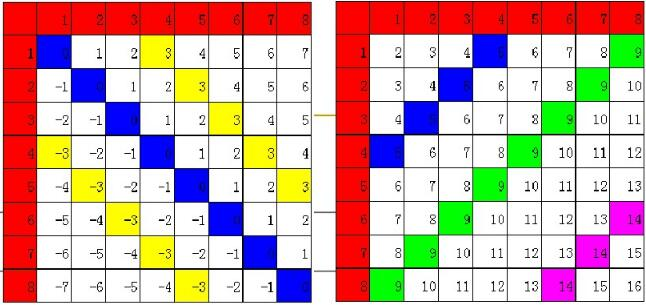
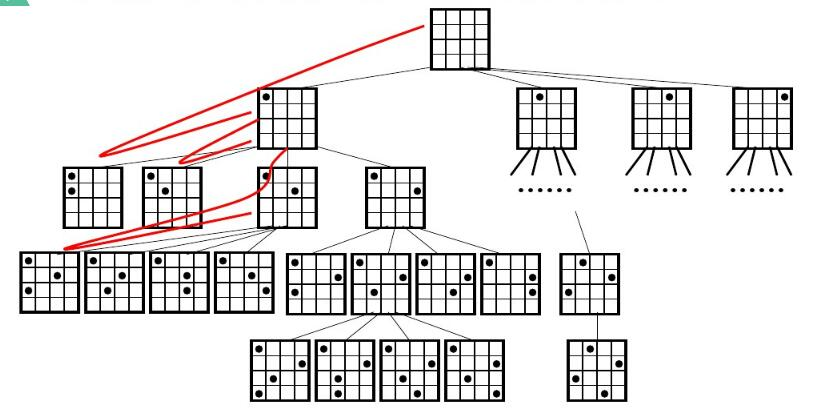

# 八皇后问题描述

八皇后问题是一个以国际象棋为背景的问题：如何能够在8*8的国际象棋棋盘上放置八个皇后，使得任何一个皇后都无法直接吃掉其他的皇后？规则：为了达到此目的，任两个皇后都不能处于同一条横行、纵行或斜线上。求所有的解。

## 问题分析
* 设八个皇后为x<sub>i</sub>，分别在第i行（i=1,2...8）；
* 问题的解态：可以用(1,x<sub>1</sub>),(2,x<sub>2</sub>).....,(8,x<sub>8</sub>)表示8个皇后的位置；由于行号固定，可简单记为(x<sub>1</sub>,x<sub>2</sub>.....,x<sub>8</sub>)

## 如何符合规则呢？
* 行：保证一行一个皇后；
* 列：保证一列一个皇后；
* 对角线：主对角线的x-y与从对角线的x+y存在特殊关系，如图：



### 约束条件
* 不在同一列：x<sub>i</sub> != x<sub>j</sub>;
* 不在同一主对角线上：x<sub>i</sub>-i != x<sub>j</sub>-j
* 不在同一负对角线上：x<sub>i</sub>+i != x<sub>j</sub>+j

* 违规的情况可以整合改写为： (abs(x<sub>i</sub>-x<sub>j</sub>) == abs(i-j)) or (x<sub>i</sub> == x<sub>j</sub>)


# 解决八皇后问题常用的算法：

* 枚举法解决
* 非递归回溯法解决
* 递归回溯法解决
  
## 枚举法

这是一种最简单的算法，通过八重循环模拟搜索空间中的8<sup>8</sup>个状态，按深度优先思想，把第1个皇后放在第1列，然后开始搜索第2到第8个皇后的合理位置，每个皇后只能在同一行的8个位置存放，每前进一步检查是否满足约束条件，不满足时，检查下一个位置，若满足约束条件，开始下一个皇后的合理位置检查，直到找出8个皇后的所有合理位置（即问题的全部解）。
### 盲目的枚举算法

```js
/**
* 所有可能都进行尝试
* 执行完的耗时为：40256ms
*/
var x1, x2, x3, x4, x5, x6, x7, x8;

function check(xi, n) {
    for (var i = 2; i <= n; i++) {
        for (var j = 1; j < i; j++) {
            if (eval(`x${i} == x${j} || Math.abs(x${i}-x${j}) == Math.abs(${i}-${j})`)) return 0;
        }
    }
    return 1;
}
var arr = [];

function main() {
    for (x1 = 1; x1 <= 8; x1++) {
        for (x2 = 1; x2 <= 8; x2++) {
            for (x3 = 1; x3 <= 8; x3++) {
                for (x4 = 1; x4 <= 8; x4++) {
                    for (x5 = 1; x5 <= 8; x5++) {
                        for (x6 = 1; x6 <= 8; x6++) {
                            for (x7 = 1; x7 <= 8; x7++) {
                                for (x8 = 1; x8 <= 8; x8++) {
                                    if (check(x8, 8) == 1) arr.push([x1, x2, x3, x4, x5, x6, x7, x8]);
                                }
                            }
                        }
                    }
                }
            }
        }
    }
}


var starTime = Date.now();
main();
let endTime = Date.now();
console.log(`总共执行${endTime-starTime}ms`);//40256~45767ms
console.log(`共有${arr.length}种方法，分别是：`, arr);
```

## 回溯法

回溯法实际是一个类似枚举的搜索尝试方法，它的主题思想是在搜索尝试中找问题的解，当不满足求解条件就“回溯”（返回），尝试别的路径。回溯算法是尝试搜索算法中最为基本的一种算法，其采用了一种“走不通就掉头”的思想，作为其控制结构。

回溯法有“通用的解题法”之称。回溯法的基本做法是搜索，能避免不必要的穷举式搜索法。

### 非递归回溯解决八皇后问题
回溯法指导思想**走不通，就掉头**。 回溯就像人走迷宫一样，先选择一个前进方向尝试，一步步试探，在遇到死胡同不能再往前的时候就会退到上一个分支点，另选一个方向尝试，一步步试探，在遇到死胡同不能再往前的时候就会退到上一个分支点，另选一个方向尝试，而在前进和回撤的路上都设置一些标记，以便能够正确返回，直到达到目标或者所有的可行方案都已经尝试完为止。



```js
/**
* 添加约束的枚举算法
* 约束：走不通，就掉头
* 执行完的耗时为：24ms
*/
var x1,x2,x3,x4,x5,x6,x7,x8;

function check(xi,n){
    for(var i=1; i<= n-1;i++){
        var xn = eval(`x${i}`);
        if(Math.abs(xi-xn) == Math.abs(i-n) || xi == xn) return 0;
    }
    return 1;
}

let arr = [];
function main(){
    for(x1=1;x1<=8;x1++){
	for(x2=1;x2<=8;x2++){
		if(check(x2,2)==0) continue;
		for(x3=1;x3<=8;x3++){
			if(check(x3,3)==0) continue;
			for(x4=1;x4<=8;x4++){
				if(check(x4,4)==0) continue;
				for(x5=1;x5<=8;x5++){
					if(check(x5,5)==0) continue;
					for(x6=1;x6<=8;x6++){
						if(check(x6,6)==0) continue;
						for(x7=1;x7<=8;x7++){
							if(check(x7,7)==0) continue;
							for(x8=1;x8<=8;x8++){
								if(check(x8,8)==0) continue;
								else{
								    arr.push([x1,x2,x3,x4,x5,x6,x7,x8]);
								}
							}
						}
					}
				}
			}
		}
	}
    }
}

var starTime = Date.now();
main();
let endTime = Date.now();
console.log(`总共执行${endTime-starTime}ms`);//15~17ms
console.log(`共有${arr.length}种方法，分别是：`,arr);//92种 打印耗时间较长
```
## 递归回溯解决八皇后问题
对于回溯算法，更方便地是用递归控制方式实现，这种方式也可以解决任意的n皇后问题。我们假设有一个quees可以放皇后，递归算法框架
```js
var a = new Array(n);//n 个皇后;
Queens(k){
    if(k>n){
        //即表示最后一个皇后摆放完毕，输出结果；
    }else{
        for(i="下界";i<="上界";i++){//枚举第k个皇后的所有路径；1,2,3,4...n
            a[k] = i;
            if(check(a,k)){//满足限界函数和约束条件；
                Queens(k+1);//递归摆放下一个皇后。
            }
        }
    }
}
```

由于递归支持n个皇后的放置，check方法在实现上略有不同，但check的检查思路相同。递归调用、回溯的整个过程是非线性的，策略是**能进则进，不能进则换，不能换则退**。

```js
var n = 8; //在8*8的方格放置8个皇后(n个皇后)

var a = new Array(n);
var items = [];

function check(cur) {
    for (var j = 0; j < cur; j++) {
        if (Math.abs(a[cur] - a[j]) == Math.abs(cur - j) || a[cur] == a[j]) return false;
    };
    return true;
}

function queen(k) {
    if (k == a.length) {
        items.push(a.map(item => item + 1)); //数组从0开始，而放置位置是从1开始的。
    } else {
        for (var i = 0; i < a.length; i++) {
            a[k] = i; //当前皇后放置的位置
            if (check(k)) {
                queen(k + 1);
            }
        }
    }
};
var starTime = Date.now();
queen(0); //数组中第一个的下标为0；
let endTime = Date.now();
console.log(`总共执行${endTime-starTime}ms`); //4~7ms
console.log(`共有${arr.length}种方法，分别是：`, items);//92种 打印耗时间较长
```

# 总结

| 算法名字 | 计算耗时 |
| ---- | --- | --- |
| 枚举法 | 40256~45767ms|
| 非递归回溯法 | 15~17ms| 
| 递归回溯法 | 4~7ms |


# 参考
* [算法设计与分析](https://wenku.baidu.com/view/00ede8f858f5f61fb7366643.html?from=search)
* [八皇后问题](https://wenku.baidu.com/view/d1e9d6fe02020740bf1e9bce.html?from=search)
