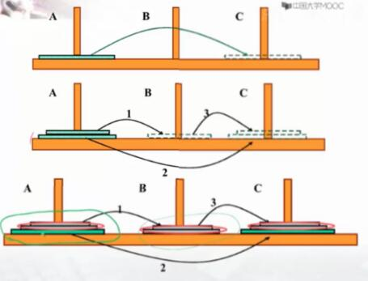
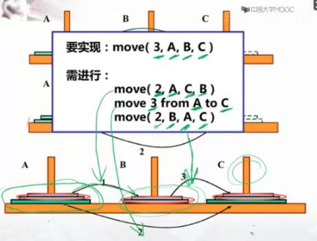

# 概述
想起递归就是无限的嵌套逻辑，借助笔和纸来理解递归时都会觉得非常困难。但如果使用计算机时则变得更简单和优美。

使用递归求解问题时，关注点要放在*求解目标* 上。把递归方法，想想成一个可以回答令人"头疼"问题的解。

# 汉诺塔问题
故事： 相传在古代印度的Bramah庙中，有位僧人整天把三根柱子上的金盘倒来倒去，他想把64个一个比一个小的金盘从一根柱子上移动到另一根柱子上。移动过程中恪守下述规则：每次只允许移动一只盘，且大盘不得落在小盘上面。



无论多少，要移动到C只有三步。小的移动到B，大的移动到C，B上面的移动到C。我们假设有一个方法 move 可以告诉我们移动过程。大致过程如下：



解决3个和解决多个一样的，要将n个从A移动到C(move(n,A,B,C)),则需进行：
* move(n-1,A,C,B)
* move from A to C
* move(n-1,B,A,C)

**对于这种递归问题，不要太纠结于代码是如何运行的，要宏观的把握，把步骤抽象起来，具体怎么移动让程序去做。** 

```js
function move(m,x,y,z){
    if(m === 1){
        console.log(`把一个盘子从${x}移动到${z}`)
    }else{
        move(m-1,x,z,y);
        console.log(`把一个盘子从${x}移动到${z}`);
        move(m-1,y,x,z)
    }
}

function main(n){
    console.log(`在3根柱子上移动${n}只盘的步骤为：`)
    move(n,"A","B","C");
}

main(3);
```
调用move后，可以得到如下过程。


## 总结
解决这个问题跟一个脑筋急转弯很像：“把一头大象装进冰箱总共需要几步？”。解决这类问题要**模拟连续发生的动作**。方法：
* 搞清楚 连续发生的动作是什么：move(m,x,y,z)
* 搞清楚 不同次动作之间的关系：
```js
move(m-1,x,z,y);
console.log(`把一个盘子从${x}移动到${z}`);
move(m-1,y,x,z)
```
* 搞清楚 边界条件是什么：
```js
if(m === 1){
    console.log(`把一个盘子从${x}移动到${z}`)
}
```
# 放苹果
* 题目描述：把M个同样的苹果放在N个同样的盘子里，允许有的盘子空着不放，问共有多少种不同的分法？
* 问题：M个苹果放入N个盘子，多少种方法
* 假设：有一个函数f(m,n)能告诉我答案；
* 测试：输入7 3 ；输出 8； 注意，5,1,1 和 1,5,1 是同一种分法

## 分析
* 如果：n/盘子数 > M/苹果数: if(n > m) f(m,n) = f(m,m)
* 如果：M/苹果数 >= n/盘子数
    * 有盘子空着：f(m,n) = f(m,n-1)
    * 没盘子空着：f(m,n) = f(m-n,n);
```js
 function count(m,n){
     if(m <= 1 || n <= 1 ) return 1;
     if(m<n){
         return count(m,m)
     }else{
         return count(m,n-1) + count(m-n,n)
     }
 }
```
## 总结
* 先假设 有一个函数 能 给出答案：count(m,n)
* 在利用 这个函数 的前提下，分析如何解决问题；
* 搞清楚 最简单的情况下 答案 是什么。

# 递归的作用
* 用递归来完成递推
    * 方法：
        * 把关注点放在要求解的目标上；
        * 找到 第n次 与 第n-1次执行 之间的关系；
        * 确定 第1次 的返回结果；
* 模拟连续发生的动作
    * 方法
        * 搞清楚 连续发生的动作 是什么
        * 搞清楚 不同次动作之间的关系；
        * 搞清楚 边界条件是什么；
* 进行 “自动的分析”
    * 方法
        * 先假设 有一个函数 能 给出答案；
        * 在利用 这个函数 的前提下，分析如何解决问题；
        * 搞清楚 最简单的情况下 答案是什么；

