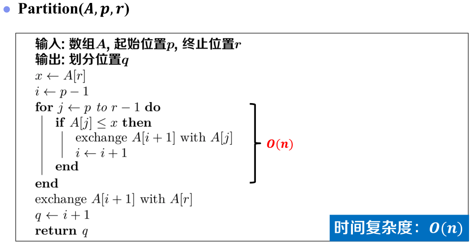
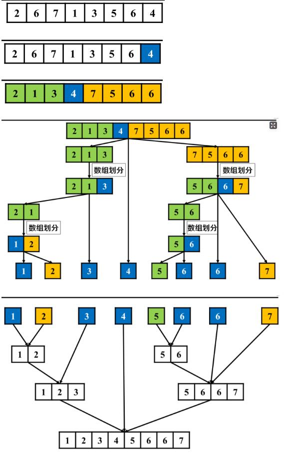
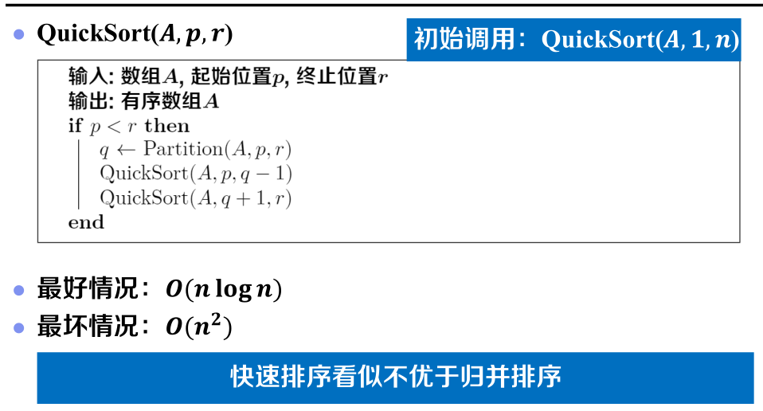
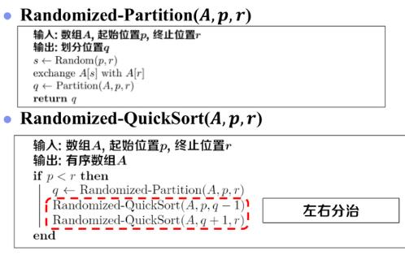
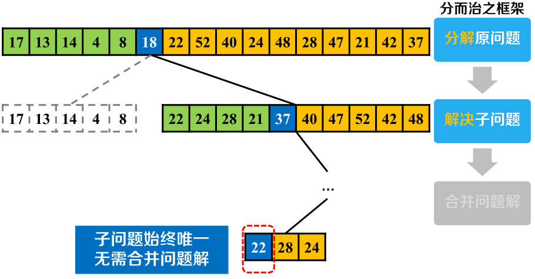
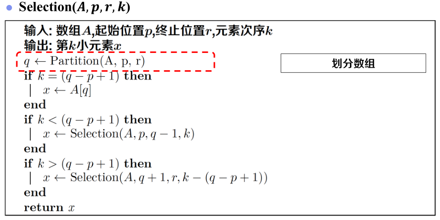
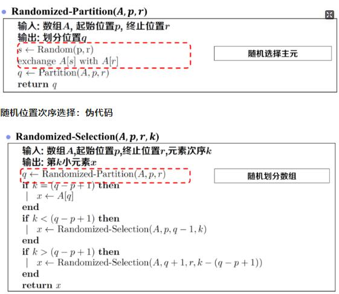

# 快速排序
归并排序：简化分解，侧重合并
快速排序：侧重分解，简化合并
## 数组划分
* 基本思想
  * 任选元素x作为分界线，称为**主元(pivot)**
  * 交换重排，满足x左侧元素小于右侧
* 实现方法
  * 选取固定位置主元x(如尾元素)
  * 维护两个部分的右端点变量i,j
  * 考察数组元素A[j]，**只和主元比较**
    * 若A[j]<=x，则交换A[j] 和 A[i+1]，i,j右移
    * 若A[j]>x，则j右移
  * 把主元放在中间作分界线
## 伪代码

# 算法框架
* 分解 原问题
* 解决 子问题
* 合并 问题解

## 算分实例

## 伪代码

问题：如何摆脱输入导致最坏情况的困境？
* 反思最差情况
  * 数组划分时选取固定位置主元，可以针对性构造最差情况
* 解决方案
  * 数组划分时选取 随机 位置主元，无法针对性构造最差情况

## 优化后的伪代码

* 期望时间复杂度：O(nlogn)

# 排序算法比较
<table>
    <tr><td>算法名称</td><td>时间复杂度</td></tr>
    <tr><td>选择排序</td><td>O(n2)</td></tr>
    <tr><td>插入排序</td><td>O(n2)</td></tr>
    <tr><td>归并排序</td><td>O(nlogn)</td></tr>
    <tr><td rowspan="2">快速排序</td><td>最差：O(n2)</td></tr>
    <tr><td>期望: O(nlogn) </td></tr>
</table>

问题：能否突破O(nlogn)？
> 基于比较的排序，时间复杂度下届为 Ω(nlogn)

# 应用：次序选择问题
输入
* 包含n个不同的元素的数组A[1...n]
* 整数k(1<= k <=n)

输出
* 数组A[1..n]中第k小的元素(1<= k <=n)

## 排序求解
* 数组排序
  * 求得所有元素的次序
  * 时间复杂度：O(nlogn)
* 选择元素
  * 求得**第8个**的元素
  * 时间复杂度：O(1)

### 问题分析
问题：是否有必要求得所有元素的次序？
> 不必求得所有元素次序

## 固定位置划分求解
* 选取固定位置主元，小于主元的元素个数q-p
  * 情况1：k=q-p+1，A[q]为数组第k小元素
  * 情况2：k< q-p+1, 在A[p..q-1]中寻找第k小元素
  * 情况3：k>q-p+1，在A[q+1..r]中寻找第k-(q-p+1)小元素
  

### 伪代码

问题：如何摆脱最坏情况的困境？
> 使用 随机位置 划分

## 随机位置划分求解
### 伪代码

# 小结

| 算法名称 | 最好时间复杂度 | 最坏时间复杂度   | 期望时间复杂度 |
| -------- | -------------- | ---------------- | -------------- |
| 快速排序 | O(nlogn)       | O(n2) | O(nlogn)       |
| 次序选择 | O(n)           | O(n2) | O(n)           |
