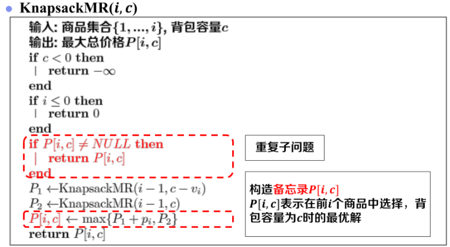

# 概述
从 背包问题 开始 接触动态规划的算法。动态规划确实高效， 但对动态规划的为何用表格，就能解决问题却一直不解。

[百科的概念介绍:](https://baike.baidu.com/item/%E5%8A%A8%E6%80%81%E8%A7%84%E5%88%92/529408#2)
> 动态规划程序设计是对解最优化问题的一种途径、一种方法，而不是一种特殊算法。不像搜索或数值计算那样，具有一个标准的数学表达式和明确清晰的解题方法。动态规划程序设计往往是针对一种最优化问题，由于各种问题的性质不同，确定最优解的条件也互不相同，因而动态规划的设计方法对不同的问题，有各具特色的解题方法，而不存在一种万能的动态规划算法，可以解决各类最优化问题。 因此读者在学习时，除了要对基本概念和方法正确理解外，必须具体问题具体分析处理，以丰富的想象力去建立模型，用创造性的技巧去求解。我们也可以通过对若干有代表性的问题的动态规划算法进行分析、讨论，逐渐学会并掌握这一设计方法。

基本思想介绍：
> 动态规划算法通常用于求解具有某种最优性质的问题。在这类问题中，可能会有许多可行解。每一个解都对应于一个值，我们希望找到具有最优值的解。**动态规划算法与分治法类似，其基本思想也是将待求解问题分解成若干个子问题，先求解子问题，然后从这些子问题的解得到原问题的解。与分治法不同的是，适合于用动态规划求解的问题，经分解得到子问题往往不是互相独立的。若用分治法来解这类问题，则分解得到的子问题数目太多，有些子问题被重复计算了很多次。如果我们能够保存已解决的子问题的答案，而在需要时再找出已求得的答案，这样就可以避免大量的重复计算，节省时间。我们可以用一个表来记录所有已解的子问题的答案。不管该子问题以后是否被用到，只要它被计算过，就将其结果填入表中。这就是动态规划法的基本思路。** 具体的动态规划算法多种多样，但它们具有相同的填表格式。

# [背包问题的再理解](https://www.yuque.com/alien-ax3ws/cmoq0h/pnt25w#x8ZPh)
在 背包问题 中，递归求解中存在重复计算的问题，进而引入了 带备忘录递归。

其实不管用蛮力枚举、递归都要枚举所有的可能。而这个备忘录 P[i,c] 避免重复计算的同时，也保存了所有的结果。

**问题：是否可以不递归，直接求解P[i,c]?**

从KnapsackMR中可以知道，计算KnapsackMR(i,c)时，会查 KnapsackMR(i-1,c-v) 和 KnapsackMR(i-1,c) 并取最大值。

进而 观察子问题依赖关系，进而确定计算顺序。商品与空间计算完，就可以得到最优解。

# 对比
<table>
    <tr><td></td><td>带备忘递归</td><td>递推求解</td></tr>
    <tr><td>相同</td><td colspan="2">分解问题，寻找关系</td></tr>
    <tr><td>不同</td><td>自顶向下</td><td>自底向上</td></tr>
</table>

# 总结
如何设计一个动态规划算法？四个步骤
* 问题结构分析
  * 给出问题表示，明确原始问题
* **递推**关系建立
  * 分析最优结构，构造递推公式
* 自底向上计算
  * 确定计算顺序，依次求解问题
* 最优方案追踪
  * 记录决策过程，输出最优方案

