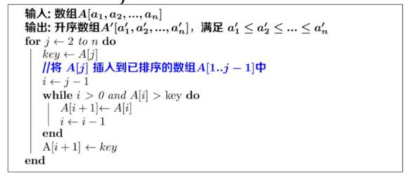

# 问题
对 **[125,130,132,123,127,129,117,121,126,116,120,122]** 进行升序排序。

# 选择排序

## 伪代码


## 实现代码
```js
var count = 0;
function xuanzepaixu(arr=[]){
    let l = arr.length;
    for(i=0;i<l-1;i++){
        for(j=i+1;j<l;j++){
            count++;
            let ai = arr[i];
            let aj = arr[j]
            if(ai > ai){
                arr[i] = aj;
                arr[j] = ai;
            }
        }
    }
}
console.time('xuanzepaixu');
xuanzepaixu([125,130,132,123,127,129,117,121,126,116,120,122]);//运行 66次
console.timeEnd('xuanzepaixu');
```
# 插入排序

## 伪代码


## 实现代码
```js
var count = 0;
function charupaixu(A=[]){
    let l = A.length;
    for(j=2;j<l;j++){
        var key = A[j];
        var i = j-1;
        while(i>=0 && A[i]> key){
            count ++;
            A[i+1] = A[i];
            i = i - 1;
        }
        A[i+1] = key;
    }
    console.log(count);
}
console.time("guibing");
charupaixu([125,130,132,123,127,129,117,121,126,116,120,122]);//运行 47次
console.timeEnd("guibing");
```
# 归并排序
1945年，冯.诺依曼 提出归并排序。
## 伪代码


伪代码仅用来展示思想逻辑。

## 实现
```js
function mergeSort(A,left,right){
    if(left >= right){
        A = A.slice(left-1,right);
        return A;
    }
    var mid = Math.floor((left + right)/2);
    var leftA = mergeSort(A,left,mid);//递归求解
    var rightA = mergeSort(A,mid+1,right);//递归求解
    return merge(leftA,rightA);
}

var countA = 0;
function merge(leftA,rightA){
   let newA = [];//合并的数组
   if(leftA && rightA){
       var leftIndex = 0;
       var rightIndex = 0;
       var leftL = leftA.length;
       var rightL = rightA.length;
       if(!(leftIndex< leftL && rightIndex< rightL)) countA++;
        
       while(leftIndex< leftL && rightIndex< rightL){
           countA++;
           if(leftA[leftIndex] <= rightA[rightIndex]){
                newA.push(leftA[leftIndex]);
                leftIndex++;
           }else{
              newA.push(rightA[rightIndex]);
              rightIndex++;
           }
       }

       if(leftIndex< leftL){
           return newA.concat(leftA.slice(leftIndex,leftL));
       }else{
           return newA.concat(rightA.slice(rightIndex,rightL));
       }
   }else if(leftA){//输出左侧
       countA++;
       return leftA;
   }else if(rightA){
       countA++;
       return rightA;
   }

}
console.time("guibing");
var Arr = mergeSort([125,130,132,123,127,129,117,121,126,116,120,122],1,12);// 运行29次
console.timeEnd("guibing");
```

# 对比

| 方法       | 数据量 | 执行次数(次) | 执行时间(ms) |
| :--------- | :----- | :----------- | :----------- |
| 选择排序   | 100    | 4950         | 1.3          |
| 插入排序   | 100    | 2323         | 0.6          |
| 归并排序   | 100    | 533          | 0.6          |
| Array.sort | 100    | 529          | 0.2          |

| 方法       | 数据量 | 执行次数(次) | 执行时间(ms) |
| :--------- | :----- | :----------- | :----------- |
| 选择排序   | 5万    | 1249975000   | 3228         |
| 插入排序   | 5万    | 572937501    | 2055         |
| 归并排序   | 5万    | 698354       | 631 ~926     |
| Array.sort | 5万    | 366818       | 637~680      |

| 方法       | 数据量 | 执行次数(次) | 执行时间(ms) |
| :--------- | :----- | :----------- | :----------- |
| 选择排序   | 10万   | 4999950000   | 38691        |
| 插入排序   | 10万   | 2291699998   | 7792 ~ 9167  |
| 归并排序   | 10万   | 1492513      | 2000~ 2300   |
| Array.sort | 10万   | 734247       | 2100~2600    |

| 方法       | 数据量 | 执行次数(次) | 执行时间(ms) |
| :--------- | :----- | :----------- | :----------- |
| 归并排序   | 50万   | 8545121      | 68360        |
| Array.sort | 50万   | 3711742      | 65096        |

## 附获得数据的方法
```js
function getData(count){
    var tem = [ 125,130,132,123,127,129,117,121,126,116,120,122];
    var data = [];
    while(data.length < count){
        data = data.concat(tem);
    }
    data.length = count;
    return data;
}
```
