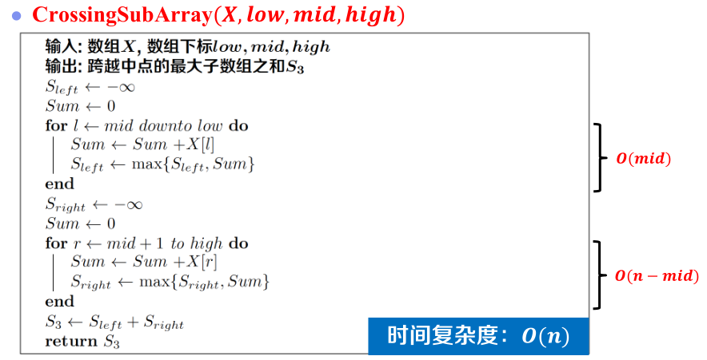

# 最大子数组问题
子数组：X = [-1,-3,3,5,-4,3,2,-2,3,6]。寻找数组X最大的非空子数组？

例如：子数组X[3...7],求和为： 3+5-4+3+2 =9；子数组X[3...10]，求和为：3+5-4+3+2-2+3+6 =16；

# 问题定义

# 蛮力枚举
## 伪代码

## 优化空间

## 优化后的伪代码

# 分而治之：一般步骤
1. 分解原问题
   原问题分解成多个子问题
2. 解决子问题
   递归地求解各个子问题
3. 合并问题解
   将结果合并为原问题解
## 思路

### 求解S3思路
* 记 mid = n/2;
* S3 可以分为左右两部分，S3 = Left + Right
* Left:以X[mid]为结尾的最大子数组之和
* Right:以X[mid+1]为开头的最大子数组之和
* 分别求出Left 和 Right，便可求出S3

## 伪代码

* 时间复杂度：O(nlogn)

# 动态规划
* 问题结构分析
  * 给出问题表示
    * D[i]: 以X[i]开头的最大子数组和
  * 明确原始问题
    * Smax=Max{D[i]}  **1<=i<=n**
* 递推关系建立
  * 分析最优（子）结构
    * D[i]: 以X[i] 开头的 最大 子数组和
    * 情况1： D[i+1] >0
      * D[i] = X[i] + D[i+1]
    * 情况2： D[i+1] <= 0
      * D[i] = X[i]
  * 构造递推公式 D[i]=
    * if D[i+1]  > 0, X[i]+D[i+1]
    * if D[i+1] <= 0, X[i]   
* 自底向上计算
  * 确定计算顺序
  
  
  
* 最优方案追踪
  * 记录决策过程
    * 构造追踪数组Rec[1...n]
    * 情况1：结尾相同
      * Rec[i] = Rec[i+1]
    * 情况2：结尾不同
      * Rec[i] = i
  * 输出最优方案
    * 从子问题中查找最优解
    * 从大子数组开头位置：i
    * 最大子数组结尾位置：Rec[i]

## 实例

## 伪代码

* 时间复杂度：O(n)

# 总结
| 算法名称 | 时间复杂度       |
| -------- | ---------------- |
| 蛮力枚举 | O(n3) |
| 优化枚举 | O(n2) |
| 分而治之 | O(nlogn)         |
| 动态规划 | O(n)             |

# 算法比较

