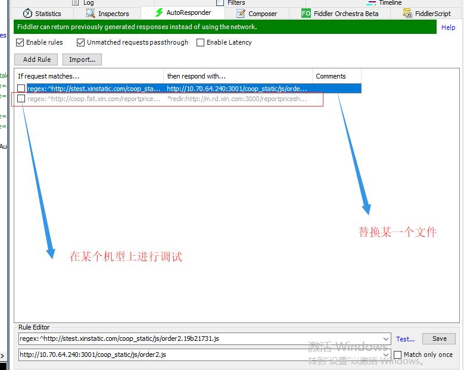

# 修复app中 bug 的常用工具
## filddler

这个图片中显示了两种使用fiddler 方式。一种替换某一个文件；一种替换整个网站；

做移动开发有时会遇到一些兼容问题，问题只在某一类机型中展示。为了解决这些问题，需要在特定环境中对问题进行定位。常用的方式是，启动开发环境，将线上某些文件或网站替换为开发环境中的代码，然后进行打印日志或者修改代码，以定位问题。

使用这种方法，可以在在某个特定环境中找寻问题。在某种机型或环境出现问题，基本上这个手机也是属于不按套路来的，解决方式也是猜。

## [spy-debugger](https://github.com/wuchangming/spy-debugger)

## [chrome 调试工具](https://developers.google.com/web/fundamentals/performance/critical-rendering-path/)
* chrome 断点
* chrome 代码栈
* chrome 渲染一些原理
* 等等

## [Lighthouse](https://developers.google.cn/web/tools/lighthouse?hl=zh-cn)

## 日常小bug
* [微信小程序中webView的问题](https://developers.weixin.qq.com/community/develop/doc/0008c824c083a8d9b0b72f80151800)