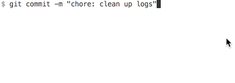

为了防止一些不规范的代码 commit并push到远端,我们可以在git命令执行前用一些钩子来检测并阻止。

* [husky](https://www.npmjs.com/package/husky)
* [pretty-quick](https://www.npmjs.com/package/pretty-quick)
> Git hooks made easy
Husky can prevent bad git commit, git push and more 🐶 woof!


```json
{
    "husky": {
        "hooks": {
            "pre-commit": "pretty-quick --staged"
        }
    }
}
```
