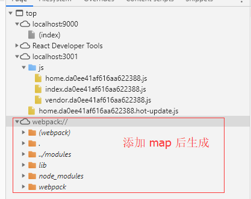

# 概述
[source map](https://www.html5rocks.com/en/tutorials/developertools/sourcemaps/)是从已转换的代码映射到原始源的文件，使浏览器能够重构原始源并在调试器中显示重建的原始源。

被浏览器执行的JavaScript代码通常会以某种方式从开发人员创建的原始资源中转译而来。源码通常会合并和最小化以高效的从服务器端获取。

为了调试工作能够使用source map，你必须：
* 生产一个source map
* 加入一个注释在转换后的文件，它指向source map。注释的语法类似：
```js
 //# sourceMappingURL=http://example.com/path/to/your/sourcemap.map
```

# 在浏览器端开启 source Map 
* [how-to-enable-sourcemaps](https://gist.github.com/jakebellacera/336c4982194bcb02ef8a)
chrome 默认是"Enable JavaScript source maps"。

# source Map 的作用
预处理器中的 Source Maps 可以使 DevTools 加载缩减代码与原始文件。然后，您可以使用原始文件设置断点和浏览代码。同时，Chrome 也会运行您的缩减代码。这会让您感觉到就像在生产环境中运行开发网站一样。

在 DevTools 中运行 Source Maps 时，您会注意到 JavaScript 不会编译，也会看到 Source Maps 引用的所有 JavaScript 文件。这是使用源映射，不过后台却在实际运行编译的代码。任何错误、日志和断点都将映射到开发代码，从而实现出色的调试！因此，您会感觉到就像在生产环境中运行开发网站一样。

# 使用 Source Maps 调试
调试代码 和启用 Source Maps 时，Source Maps 将在两个地方显示：

1. 控制台中（指向来源的链接应是原始文件，而不是生成的文件）
2. 逐步执行代码时（调用堆栈中的链接应打开原始的源文件）

使用source map 生成的文件



# [devtool type](https://survivejs.com/webpack/building/source-maps/)
webpack 中 通过 devtool: type 可以控制不同的source map。
* source-map
  > source-map is the slowest and highest quality option of them all, but that's fine for a production build.
* eval
  > eval generates code in which each module is wrapped within an eval function
* cheap-eval-source-map
  > cheap-eval-source-map goes a step further and it includes base64 encoded version of the code as a data url. The result contains only line data while losing column mappings.
* cheap-module-eval-source-map
  > cheap-module-eval-source-map is the same idea, except with higher quality and lower performance
* eval-source-map
  > eval-source-map is the highest quality option of the inline options. It's also the slowest one as it emits the most data
* cheap-source-map
  > cheap-source-map is similar to the cheap options above. The result is going to miss column mappings. Also, source maps from loaders, such as css-loader, are not going to be used.
* cheap-module-source-map
  > cheap-module-source-map is the same as previous except source maps from loaders are simplified to a single mapping per line. It yields the following output in this case.
* hidden-source-map
  > hidden-source-map is the same as source-map except it doesn't write references to the source maps to the source files. If you don't want to expose source maps to development tools directly while you wish proper stack traces, this is handy.
* nosources-source-map
  > nosources-source-map creates a source map without sourcesContent in it. You still get stack traces, though. The option is useful if you don't want to expose your source code to the client.

# source map 的使用
* 开发环境中 source map 是必须的。
* 上线后，可以使用source-map 和 source-map-support 进行源码解析。
* 支持v8的浏览器，可以使用stack-trace-api 对错误进行细致处理。

# 资料
* [Use_a_source_map](https://developer.mozilla.org/zh-CN/docs/Tools/Debugger/How_to/Use_a_source_map)
* [chrome-devtools/javascript/source-maps](https://developers.google.com/web/tools/chrome-devtools/javascript/source-maps)
* [building/source-maps](https://survivejs.com/webpack/building/source-maps/)
* [source map 规范](https://docs.google.com/document/d/1U1RGAehQwRypUTovF1KRlpiOFze0b-_2gc6fAH0KY0k/edit)
* [mozilla/source-map](https://github.com/mozilla/source-map)
* [生产环境通过SourceMap还原压缩后JavaScript错误](https://zhuanlan.zhihu.com/p/64033141)
* [how-to-enable-sourcemaps](https://gist.github.com/jakebellacera/336c4982194bcb02ef8a)
* [source map 解析](https://github.com/joeyguo/blog/issues/14)
* [v8.dev/docs/stack-trace-api](https://v8.dev/docs/stack-trace-api)
* [v8](https://github.com/v8/v8)

# 使用sourceMap 还原错误
* [source-map](https://github.com/mozilla/source-map)
* [source-map-support](https://www.npmjs.com/package/source-map-support)
* [异常监控的文章](https://github.com/joeyguo/blog/issues/13)
* [搭建错误处理](https://zhuanlan.zhihu.com/p/26267678)