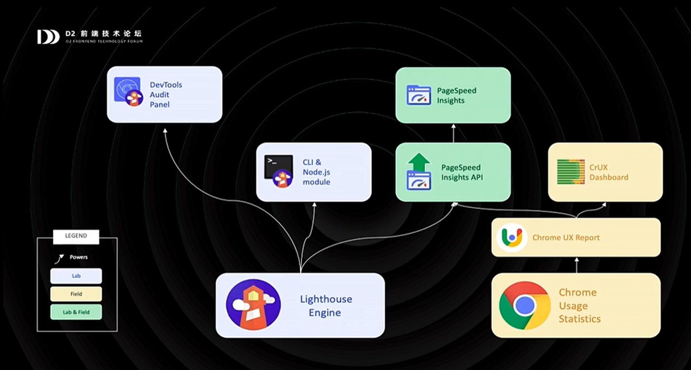

# Core Web Vitals (核心网页指标)
* FCP(First Contentful Paint)
* SI(Speed Index)
* LCP(Largest Contentful Paint)
* TTI(Time to Interactive)
* TBT(Total Blocking Time)
* CLS(Cumulative Layout Shift)

## LCP
最大内容绘制
* 优良 < 2.5秒
* 2.5> 需要改进 <4秒
* 4 < 差

检测页面绘制首屏的最大内容（大标或图片）元素所需时间
## FID
首次交互延迟

## CLS
累计布局偏移

# Getting started with Core Web Vitals
逐步了解 核心网站指标

* Lighthouse

  * 预防性能回滚降级
* PageSpeed Insights

  * 问题诊断
* Search Console

  * 获取站点级别视图
* Chrome DevTools

  * 本地调试和优化
* Chrome UX Report

  * 利用报表监控性能
* web.dev
  * 获取定制化的分析和指导

  
# 总结
* 关注全球趋势，所有用户的体验都相当重要
* 实验室性能数据和真实用户性能数据都必须收集
* 性能指标建议参考海外趋势
* 有效利用所有工具链，最优化开发效率及观测数据
